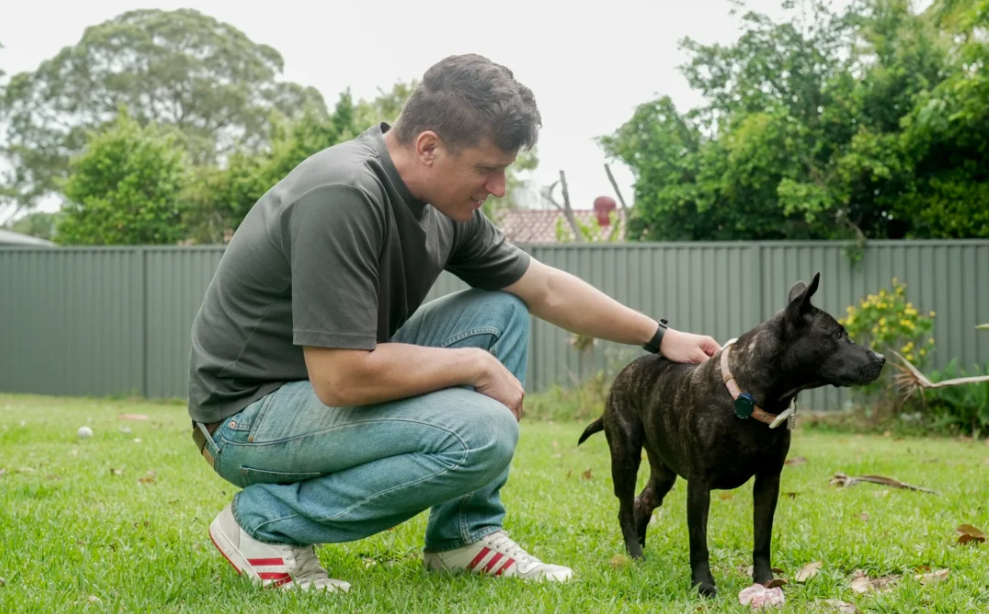

# e-portfolio-1-Artificial-Intelligence

A collection of artefacts reflecting what I've learned about Artificial Intelligence this week

---

## Artefact 1: What is Artificial Intelligence (AI)?

**Link:** [What Is AI? | Learn all about artificial intelligence](https://youtu.be/JcXKbUIebrU?si=3Wnz15saZQemGOR9)

### **Summary of the artefact**
I watched this short video about Artificial intelligence.This video provides an introduction about Artificial Intelligence(AI) and explains how AI is used in our daily life.It demonstrates AI as a large amount of data sets,combination of computer science and problem-solving techniques.The video also explains currently AI systems used for automation such as voice assistants like Alexa and Siri,customer service, and robotics that perform without difficulty and smoothly dangerous tasks.
This video also introduces three types of Artificial Intellidence;Artificial Narrow Intelligence (ANI),Artificial General Intelligence(AGI),and Artificial Super Intelligence (ASI).The ANI is a well-known and widespread AI that uses with the combination of technologies in today,while the AGI and ASI are future concepts that are still being studied.I can say confidently both of them,we will see next 10 years.
Furthermore,this video also demonstrates the benefits and drawbacks of AI.The advantages are to do repetitive tasks easily and hazordous works,saving time,reducing human error,imrpoving safety and developing technological discoveries.However,disadvantages include environmental impacts,possible job diplacements,
cybersecurity risks and high costs.
### **Justification on why I chose the artefact**
I selected this video because it is easy to uderstand and provides information clearly,smoothly.Before watching this video,I have not any idea about ANI,AGI and ASI.After watching this video,I learnt how to improve our life and do different tasks even,people can not anything like hazardous tasks, and AGI and ASI are future tools.We can also discuss about AI development,improvement of people's work.It is first term,but I learnt the basics of knowledge about Whta it is AI? and how it can impact our life.It also helped me to understand that while AI can improve efficiency and support innovation,it is important to consider ethical problems and possible risks. It will be great improvement and positive changes near future!

---

## Artefact 2: A news article I found this week
**AI, genomics, and one dog named Rosie: 5 Things the Story Get Right About Personalised Medicine**
*InGeNA(Industry Genomics Network Alliance)-22.May.2026* 

https://ingena.org.au/ai-genomics-and-one-dog-named-rosie-5-things-the-story-gets-right-about-personalised-medicine/

### **Summary of the artefact**

This article explores how a tech-savvy dog owner used genomic sequencing and AI analysis to save his the life of his dog from terminal cancer.He read her tumor's DNA with the help of AI to analyze millions of codes and spot specific cancer mutation.The AI didn't create medicine itself;it provided data that allowed university reaserchers (UNSW and UQ) to design and manufacture a custom mRNA vaccine.The experimental therapy successfully shrank Rosie's tumors.This article uses this story to show how AI acts as an accelerator in personalized medicine is becoming a reality,allowing scientists to design and create personalized treatments faster.

### **Justification on why I chose the artefact**
I chose this article because it demonstrates a practical and uplifting application of AI,contrasting with the usual negative headlines.This article gave me a much clearer and realistic of AI.It helped realaize that tools like Chatgpt,Gemini not 'magical doctor' however,high-speed analytical assistants,that still require experts,scientists and medical labs.This article connected directly our last week workshop discussions about how machine learning excels at processing massive data sets.Humsn analysts would take months or years to sort genomic data,but AI can spot patterns in just seconds.It is unbelieveble but I can say that this story as a first year student learning ICT ethics and governance showed not only the new method to manufacture personalized medicines but also I learnt the importance of safe collaboration between human experts and AI.

---

## Artefact 3: Scholary Article
**Artificial Intelligence,Machine Learning, and Robotics:The Core of Tomorrow's Industries**

*Rachel J.C. Fu, Ph.D.*
*AI, ML, & Robotics in Business. 2025, 1(2), 6-9*

*Correspondence: racheljuichifu@ufl.edu Eric Friedheim Tourism Institute | Dept. of Tourism,
Hospitality and Event Management, College of Health and Human Performance, University of
Florida, USA*

### **Abstract**
The second issue of AI, ML, and Robotics in Business arrives amid global uncertainty
and rapid technological evolution. As industries confront climate instability, labor shortages, and
digital transformation, artificial intelligence, machine learning, and robotics are becoming
essential engines of resilience and reinvention. This issue highlights sector-specific advances—
from AI-driven precision agriculture and ethical frameworks in hospitality to team science and
prevention strategies in healthcare. Contributors illustrate how these technologies move beyond
automation to elevate human intelligence, ethics, and collaboration. Central themes include the
integration of AI into trust-based services, interdisciplinary innovation, and the cultivation of
diverse intelligences to navigate the Intelligence Era. NVIDIA’s GTC 2025 conference emphasizes
this paradigm shift, revealing AI’s potential to build adaptive, human-augmenting systems across
industries. These works signal a new frontier: one where progress lies not in replacing human
effort, but in preparing society to lead with vision, empathy, and collective intelligence.

https://journals.flvc.org/aimlrb/ 

https://journals.flvc.org/aimlrb/article/download/139237/144280/277204

