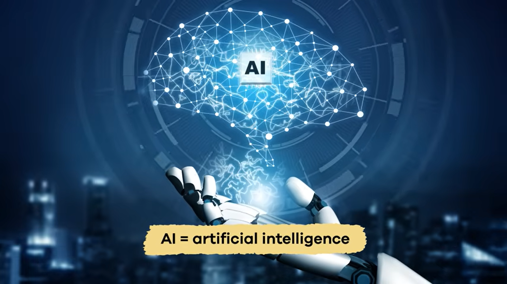

# e-portfolio-1-Artificial-Intelligence

A collection of artefacts reflecting what I've learned about Artificial Intelligence this week

---

## Artefact 1: What is Artificial Intelligence (AI)?

**Link:** [What Is AI? | Learn all about artificial intelligence](https://youtu.be/JcXKbUIebrU?si=3Wnz15saZQemGOR9)

### Summary of the artefact
I watched this short video about Artificial intelligence.This video provides an introduction about Artificial Intelligence(AI) and explains how AI is used in our daily life.It demonstrates AI as a large amount of data sets,combination of computer science and problem-solving techniques.The video also explains currently AI systems used for automation such as voice assistants like Alexa and Siri,customer service, and robotics that perform without difficulty and smoothly dangerous tasks.
This video also introduces three types of Artificial Intellidence;Artificial Narrow Intelligence (ANI),Artificial General Intelligence(AGI),and Artificial Super Intelligence (ASI).The ANI is a well-known and widespread AI that uses with the combination of technologies in today,while the AGI and ASI are future concepts that are still being studied.I can say confidently both of them,we will see next 10 years.
Furthermore,this video also demonstrates the benefits and drawbacks of AI.The advantages are to do repetitive tasks easily and hazordous works,saving time,reducing human error,imrpoving safety and developing technological discoveries.However,disadvantages include environmental impacts,possible job diplacements,
cybersecurity risks and high costs.
### Justification on why I chose the artefact
I selected this video because it is easy to uderstand and provides information clearly,smoothly.Before watching this video,I have not any idea about ANI,AGI and ASI.After watching this video,I learnt how to improve our life and do different tasks even,people can not anything like hazardous tasks, and AGI and ASI are future tools.We can also discuss about AI development,improvement of people's work.It is first term,but I learnt the basics of knowledge about Whta it is AI? and how it can impact our life.It also helped me to understand that while AI can improve efficiency and support innovation,it is important to consider ethical problems and possible risks. It will be great improvement and positive changes near future!

---

## Artefact 2: A news article I found this week
**AI, genomics, and one dog named Rosie: 5 Things the Story Get Right About Personalised Medicine**
*InGeNA(Industry Genomics Network Alliance)-22.May.2026* 

