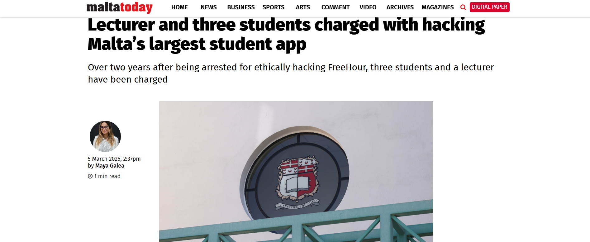
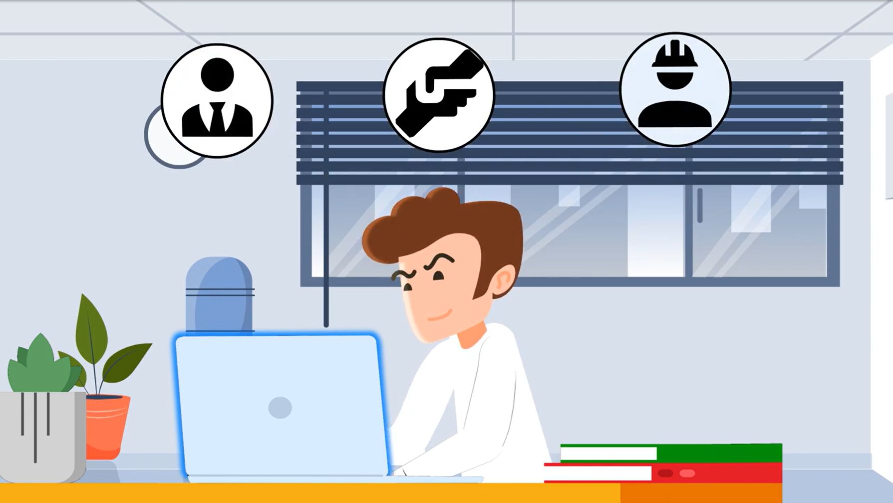

# E-portfolio-2-Ethics and Ethical Theories
A collection of artefacts reflecting what I've learned about Artificial Intelligence this week

---

## Artefact 1: Ethics of Data Breaches (YouTube Video)

**Link** https://youtu.be/luZ1y_7MC4U?si=dBtD6h6qpONx1nQ5

### **Reflection of the Artefact**
This video explains that a data breach happens when someone gets access to data shouldn't have.It breaks this down into a few types:cyber attacks  from outside hackers,accidental leaks(like falling for a phinshing email or emailing the wrong person),payment card fraud,and simply losing devices like laptops.The most was that a lot of breaches aren't caused by advanced hacking,however just a simple human mistakes.Before watching this youtube video,I mostly thought breaches as a technical problem that IT teams may fix this with better software.After that I realized that it is just an ethucal and human issue.This also connets directly to information from th unit trust and rigths.Users expect their data to respected.
Overall,this may be fairly negative but eye -opening experince because,i realized that personal data could be easily exposed when we assume its "Safe" and of course that data protection is an our ethical responsibility.Furthermore,this will make think more carefully about handling user data in any ICT role,not of course trusting "The system is seccure" but also, think about more the real people affected if that trust is broken.

## **Justification on why I chose this artefact**
I chose this video because data breaches are common and very real problem in ICT,and it connects well to the etics ideas we covered in the workshop,especially trust,privacy and responsibility.This video also very briefly and well-structured to understand and try to think about safety and more responsible.

---

## Artefact 2: The Freehour Ethical Hacking Case (News Article)

**Link** https://www.maltatoday.com.mt/news/court_and_police/133925/lecturer_and_three_students_charged_with_hacking_maltas_largest_student_app

## **Reflection and Summary of the artefact**
This article is about three university students in Malta who found flaws in FreeHour,the country's most popular student app.They just reported company and asked forn a reward.Instead of thnaking them,the company reported the students to the police,and they were later criminally charged,even though nothing was stolen.
Before reading this article,I thought hacking was simple,accessing a system without permission is wrong.This article changed that.The students were not malicious,they found a flaw,reported it,and asked for a fair reward,yet were treated like criminals,it is unbelieveble.That made me realise intent matters just as much as action itself.Think about it Kant's rule test,if nobody ever reported security flaws out of fear,real dangers would just stay hidden and get exploited by people with bad instead.Thuis was a mixed experince,but also eye-opening and it made me think more carefully about risks of doing the right thing.

## **Justification on why I chose this article**
I chose this this article because it shows a real grey area in ICt ethics,where trying to do the right thing still led to serious consequencess.It also connects well to the ethical theories form the workshop,since it's exactly the kind of case those theories are meant to help you.I also mention that it is a real situation of black and white thing.It depend on your situation,if you choose the right thing,it would be danger of your life.This article has shown exatly the real experience.

---

## Artefact 3: Misuse of Privileges / Insider Threats (YouTube Video)

**Link**  https://youtu.be/NG2OJCdeM_A?si=j3YU5mmmlysADJoc

## **Reflection and Summary of the aretfact** 

This video explains insider threats,security risks that come from people who already have legitimate access to a company's systems,like employees or contractors.It covers how this access can be misused either on purpose (for revenge or money) or by accident  (carelessness or falling for a scam).Befote watching this youtube video,I had idea about cybersecurity only threats as coming from outside hackers trying to break in.I learnt some useful datas after watching,especially that the biggest risks comes from people who already have permisison to be there,which honestly had not crossed my mind before.What stood out was that not all insider threats are maicious,a lot from just careless mistakes,like someone saving data somewhere they should not have.Overall,this was useful experience for me,because of it increased my attention and try to be carefully especially in every situation,it's an ethical responsibility.

## **Justification on why I chose this article**
I chose this video as it's a differnet angle on ICT ethics compared to my other artefacts,also this showed us the risk comes from inside an organisation,not an outside attackers.It felt like an important gap to cover,since trust and acces are things every.Furthermore,I easily understood the main point of the video,It was clearly and smoothly expressed.

## Artefact 4: Kantianism and the GenAI Assignment Scenario

## **Reflection and Summary of the Artefact**

In this week's workshop,we looked at a scenario where a time-poor student used a generative AI tool write their final report and submitted it as their own work.We used Kant's tests to work out whether it actually wrong or just a shortcut.Before the workshop,I had noit really thought about using AI for assignments was ethically wrong,it's become such a normal part of student life that i never questioned it so far.This scenario helped me to think about deeply.What stood out most was Kan'ts test,if you imagine every student doing this,reports would stop meaning anything,and lecturer would have no reason to grade them at all.It's is not just the one student is cheating it's "what happens if this becomes the norm".
Even after going through Kant's reasoning,I'm still a bit torn.The logic makes sense,I get why it's wrong when you break it down like that.But I also get why a student under pressure might see it as a practical shortcut,not some big ethical violation.So finally,it left me feeling fairlyneutral,jsut more aware that it's more complicated than I first assumed.That having a framework like Kant's gives you a proper way to think through grey areas instead of just going with your gut,and going forward I'll be more mindful about why something counts as ethical or not.

---

#References in CQU Harvard style

References in CQU Harvard Style

CQUniversity 2026, 'Week 4: Ethics and ethical theories', COIT11223 ICT Ethics and Governance in Society, workshop slides, CQUniversity Moodle, viewed 12 August 2026, https://moodle.cqu.edu.au.

DataGuard 2023, Data Breaches Explained, video, YouTube, 2 February, viewed 12 August 2026, https://www.youtube.com/watch?v=luZ1y_7MC4U.

MaltaToday 2025, Lecturer and three students charged with hacking Malta's largest student app, viewed 12 August 2026, https://www.maltatoday.com.mt/news/court_and_police/133925/lecturer_and_three_students_charged_with_hacking_maltas_largest_student_app.

2025, What Is an Insider Threat?, video, YouTube, 29 April, viewed 12 August 2026, https://www.youtube.com/watch?v=NG2OJCdeM_A.

