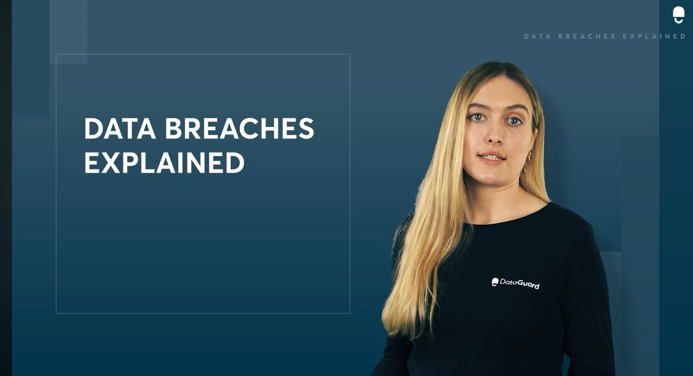

# E-portfolio-2-Ethics and Ethical Theories
A collection of artefacts reflecting what I've learned about Artificial Intelligence this week

---

## Artefact 1: Ethics of Data Breaches (YouTube Video)

**Link:**(https://youtu.be/luZ1y_7MC4U?si=dBtD6h6qpONx1nQ5)

### **Reflection of the Artefact**
This video explains that a data breach happens when someone gets access to data shouldn't have.It breaks this down into a few types:cyber attacks  from outside hackers,accidental leaks(like falling for a phinshing email or emailing the wrong person),payment card fraud,and simply losing devices like laptops.The most was that a lot of breaches aren't caused by advanced hacking,however just a simple human mistakes.Before watching this youtube video,I mostly thought breaches as a technical problem that IT teams may fix this with better software.After that I realized that it is just an ethucal and human issue.This also connets directly to information from th unit trust and rigths.Users expect their data to respected.
Overall,this may be fairly negative but eye -opening experince because,i realized that personal data could be easily exposed when we assume its "Safe" and of course that data protection is an our ethical responsibility.Furthermore,this will make think more carefully about handling user data in any ICT role,not of course trusting "The system is seccure" but also, think about more the real people affected if that trust is broken.

## **Justification on why I chose this artefact**
I chose this video because data breaches are common and very real problem in ICT,and it connects well to the etics ideas we covered in the workshop,especially trust,privacy and responsibility.This video also very briefly and well-structured to understand and try to think about safety and more responsible.
